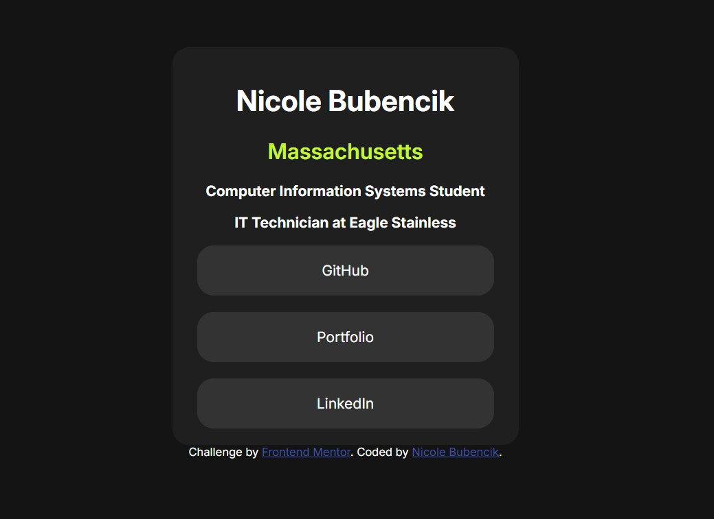

# Frontend Mentor - Social links profile solution

This is a solution to the [Social links profile challenge on Frontend Mentor](https://www.frontendmentor.io/challenges/social-links-profile-UG32l9m6dQ). Frontend Mentor challenges help you improve your coding skills by building realistic projects. 

## Table of contents

- [Overview](#overview)
  - [The challenge](#the-challenge)
  - [Screenshot](#screenshot)
  - [Links](#links)
- [My process](#my-process)
  - [Built with](#built-with)
  - [What I learned](#what-i-learned)

## Overview

### The challenge

Users should be able to:

- See hover and focus states for all interactive elements on the page

### Screenshot

### Links

- [Solution URL](https://github.com/nikkiBubencik/social-links-profile)
- [Live Site URL](https://nikkibubencik.github.io/social-links-profile/)

## My process

### Built with

- Semantic HTML5 markup
- CSS custom properties
- Flexbox
- CSS Grid
- Mobile-first workflow

### What I learned

During this project, I focused heavily on improving my responsive design skills. I practiced building a layout that adapts well across different screen sizes, especially by starting with a mobile-first approach and then adding styles for larger screens using media queries.

I also learned how to center elements inside grid cells. I combined CSS Grid with Flexbox where necessary, I was able to make sure all components were aligned properly regardless of screen size. This helped me understand how layout systems in CSS can work together to achieve clean, consistent designs.
